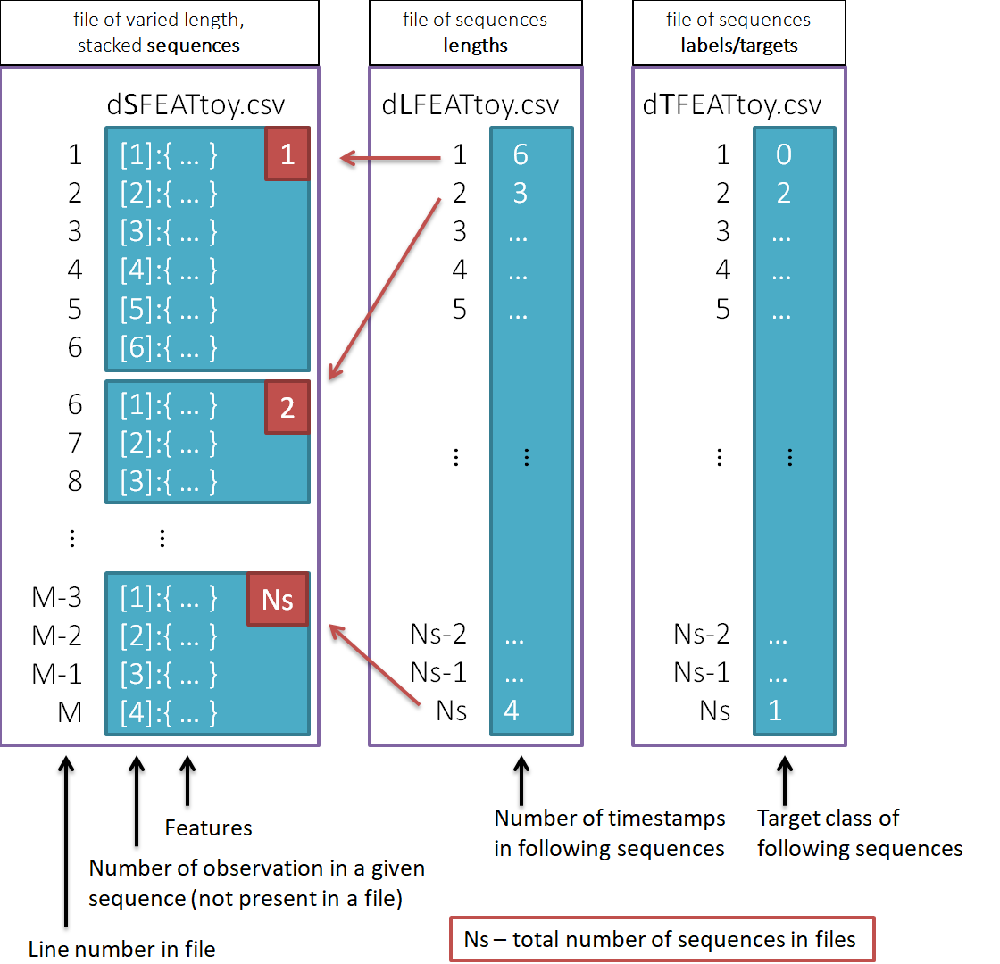

# RNNtoyPipeline
[In this notebook](RNNtoyPipeline.ipynb) a toy example of pipeline for preparing variable length sequences is presented. They can be then used as input data e.g. to Recurrent Nerual Networks.
 

#### Input files description
Ine the notebook three .csv files are loaded. First one contains stacked sequences of observations (each containing a set of features). The remaining two contain: length of following sequences and a target labels. Scheme explains how the lengths apply to stacked sequences:

